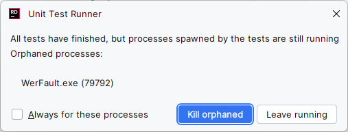

# Screencasting

https://chromedevtools.github.io/devtools-protocol/

https://github.com/hardkoded/puppeteer-sharp/issues/2943

[How the node library does it](https://github.com/puppeteer/puppeteer/blob/a18a0de7f32027f48c838875cafa5e59ce5a6cac/packages/puppeteer-core/src/node/ScreenRecorder.ts#L38).

* spawns ffmpg
* writes bytes directly to stdin

# To do

## Resolve "CA1416: This call site is reachable on all platforms. 'Bitmap' is only supported on: 'windows' 6.1 and later."

Add pragma escape at the moment.

## Resolve "Error CS8002 : Referenced assembly 'SharpAvi, Version=3.0.1.0, Culture=neutral, PublicKeyToken=null' does not have a strong name."

I added this in the interim

```diff
$ git diff -- lib/PuppeteerSharp.Tests/PuppeteerSharp.Tests.csproj
diff --git a/lib/PuppeteerSharp.Tests/PuppeteerSharp.Tests.csproj b/lib/PuppeteerSharp.Tests/PuppeteerSharp.Tests.csproj
index 5becc38d..320ac2c4 100644
--- a/lib/PuppeteerSharp.Tests/PuppeteerSharp.Tests.csproj
+++ b/lib/PuppeteerSharp.Tests/PuppeteerSharp.Tests.csproj
@@ -45,4 +48,7 @@
        <ItemGroup>
          <None Remove="TestExpectations\TestExpectations.json" />
        </ItemGroup>
+  <PropertyGroup>
+    <NoWarn>8002</NoWarn>
+  </PropertyGroup>
 </Project>
```

# Troubleshooting

## ffmpeg exited with non-zero exit-code; Error during demuxing: Invalid argument

```shell
FFMpegCore.Exceptions.FFMpegException : ffmpeg exited with non-zero exit-code (-22 - ffmpeg version 7.1.1-essentials_build-www.gyan.dev Copyright (c) ...

FFMpegCore.Exceptions.FFMpegException : ffmpeg exited with non-zero exit-code (-22 - ffmpeg version 7.1.1-essentials_build-www.gyan.dev Copyright (c) 2000-2025 the FFmpeg developers
  built with gcc 14.2.0 (Rev1, Built by MSYS2 project)
  configuration: --enable-gpl --enable-version3 --enable-static --disable-w32threads --disable-autodetect --enable-fontconfig --enable-iconv --enable-gnutls --enable-libxml2 --enable-gmp --enable-bzlib --enable-lzma --enable-zlib --enable-libsrt --enable-libssh --enable-libzmq --enable-avisynth --enable-sdl2 --enable-libwebp --enable-libx264 --enable-libx265 --enable-libxvid --enable-libaom --enable-libopenjpeg --enable-libvpx --enable-mediafoundation --enable-libass --enable-libfreetype --enable-libfribidi --enable-libharfbuzz --enable-libvidstab --enable-libvmaf --enable-libzimg --enable-amf --enable-cuda-llvm --enable-cuvid --enable-dxva2 --enable-d3d11va --enable-d3d12va --enable-ffnvcodec --enable-libvpl --enable-nvdec --enable-nvenc --enable-vaapi --enable-libgme --enable-libopenmpt --enable-libopencore-amrwb --enable-libmp3lame --enable-libtheora --enable-libvo-amrwbenc --enable-libgsm --enable-libopencore-amrnb --enable-libopus --enable-libspeex --enable-libvorbis --enable-librubberband
  libavutil      59. 39.100 / 59. 39.100
  libavcodec     61. 19.101 / 61. 19.101
  libavformat    61.  7.100 / 61.  7.100
  libavdevice    61.  3.100 / 61.  3.100
  libavfilter    10.  4.100 / 10.  4.100
  libswscale      8.  3.100 /  8.  3.100
  libswresample   5.  3.100 /  5.  3.100
  libpostproc    58.  3.100 / 58.  3.100
Input #0, rawvideo, from '\\.\pipe\FFMpegCore_11312':
  Duration: N/A, start: 0.000000, bitrate: 460800 kb/s
  Stream #0:0: Video: rawvideo (BGRA / 0x41524742), bgra, 800x600, 460800 kb/s, 30 tbr, 30 tbn
Stream mapping:
  Stream #0:0 -> #0:0 (rawvideo (native) -> vp8 (libvpx))
Press [q] to stop, [?] for help
[in#0/rawvideo @ 0000022c53c7f8c0] Error during demuxing: Invalid argument
[libvpx @ 0000022c53c95c00] v1.15.0-65-g95afae324
[libvpx @ 0000022c53c95c00] Neither bitrate nor constrained quality specified, using default CRF of 32 and bitrate of 256kbit/sec
[libvpx @ 0000022c53c95c00] Transparency encoding with auto_alt_ref does not work
[vost#0:0/libvpx @ 0000022c53c944c0] Error while opening encoder - maybe incorrect parameters such as bit_rate, rate, width or height.
[vf#0:0 @ 0000022c53c96a80] Error sending frames to consumers: Invalid argument
[vf#0:0 @ 0000022c53c96a80] Task finished with error code: -22 (Invalid argument)
[vf#0:0 @ 0000022c53c96a80] Terminating thread with return code -22 (Invalid argument)
[vost#0:0/libvpx @ 0000022c53c944c0] Could not open encoder before EOF
[vost#0:0/libvpx @ 0000022c53c944c0] Task finished with error code: -22 (Invalid argument)
[vost#0:0/libvpx @ 0000022c53c944c0] Terminating thread with return code -22 (Invalid argument)
[out#0/mp4 @ 0000022c53c7f680] Nothing was written into output file, because at least one of its streams received no packets.
frame=    0 fps=0.0 q=0.0 Lsize=       0KiB time=N/A bitrate=N/A speed=N/A
Conversion failed!)
   at FFMpegCore.FFMpegArgumentProcessor.HandleCompletion(Boolean throwOnError, Int32 exitCode, IReadOnlyList`1 errorData)
   at FFMpegCore.FFMpegArgumentProcessor.ProcessAsynchronously(Boolean throwOnError, FFOptions ffMpegOptions)
   at PuppeteerSharp.Tests.CDPSessionTests.Screencasting.FFMpegVideoRecorder.StopVideo() in C:\Users\BenBiddington\sauce\puppeteer-sharp\lib\PuppeteerSharp.Tests\CDPSessionTests\Screencasting\RecordingWithFFMpeg.cs:line 228
   at PuppeteerSharp.Tests.CDPSessionTests.Screencasting.FFMpegVideoRecorder.StopAsync() in C:\Users\BenBiddington\sauce\puppeteer-sharp\lib\PuppeteerSharp.Tests\CDPSessionTests\Screencasting\RecordingWithFFMpeg.cs:line 70
   at PuppeteerSharp.Tests.CDPSessionTests.Screencasting.RecordingWithFFMpegTests.ShouldWriteVideoToDisk() in C:\Users\BenBiddington\sauce\puppeteer-sharp\lib\PuppeteerSharp.Tests\CDPSessionTests\Screencasting\RecordingWithFFMpeg.cs:line 46
   at NUnit.Framework.Internal.TaskAwaitAdapter.GenericAdapter`1.BlockUntilCompleted()
   at NUnit.Framework.Internal.MessagePumpStrategy.NoMessagePumpStrategy.WaitForCompletion(AwaitAdapter awaiter)
   at NUnit.Framework.Internal.AsyncToSyncAdapter.Await[TResult](Func`1 invoke)
   at NUnit.Framework.Internal.AsyncToSyncAdapter.Await(Func`1 invoke)
   at NUnit.Framework.Internal.Commands.TestMethodCommand.RunTestMethod(TestExecutionContext context)
   at NUnit.Framework.Internal.Commands.TestMethodCommand.Execute(TestExecutionContext context)
   at NUnit.Framework.Internal.Commands.BeforeAndAfterTestCommand.<>c__DisplayClass1_0.<Execute>b__0()
   at NUnit.Framework.Internal.Commands.DelegatingTestCommand.RunTestMethodInThreadAbortSafeZone(TestExecutionContext context, Action action)


```

I got this from using `WithVideoCodec(VideoCodec.LibVpx)`:

```c#
var result = FFMpegArguments
    .FromPipeInput(new RawVideoPipeSource(CreateFrames())
    {
        FrameRate = 30
    })
    .OutputToFile(
        _opts.Path,
        true,
        options => options.WithVideoCodec(VideoCodec.LibVpx)) /* VideoCodec.Png is important */
    .ProcessAsynchronously();
```

Works when I use `WithVideoCodec(VideoCodec.Png)`.

The files we're using are PNG.

## WerFault.exe is still running after tests finish



## [AVFormatContext @ 000001a6760f3d80] Unable to choose an output format

```shell

FFMpegCore.Exceptions.FFMpegException : ffmpeg exited with non-zero exit-code (-22 - ffmpeg version 7.1.1-essentials_build-www.gyan.dev Copyright (c) ...

FFMpegCore.Exceptions.FFMpegException : ffmpeg exited with non-zero exit-code (-22 - ffmpeg version 7.1.1-essentials_build-www.gyan.dev Copyright (c) 2000-2025 the FFmpeg developers
  built with gcc 14.2.0 (Rev1, Built by MSYS2 project)
  configuration: --enable-gpl --enable-version3 --enable-static --disable-w32threads --disable-autodetect --enable-fontconfig --enable-iconv --enable-gnutls --enable-libxml2 --enable-gmp --enable-bzlib --enable-lzma --enable-zlib --enable-libsrt --enable-libssh --enable-libzmq --enable-avisynth --enable-sdl2 --enable-libwebp --enable-libx264 --enable-libx265 --enable-libxvid --enable-libaom --enable-libopenjpeg --enable-libvpx --enable-mediafoundation --enable-libass --enable-libfreetype --enable-libfribidi --enable-libharfbuzz --enable-libvidstab --enable-libvmaf --enable-libzimg --enable-amf --enable-cuda-llvm --enable-cuvid --enable-dxva2 --enable-d3d11va --enable-d3d12va --enable-ffnvcodec --enable-libvpl --enable-nvdec --enable-nvenc --enable-vaapi --enable-libgme --enable-libopenmpt --enable-libopencore-amrwb --enable-libmp3lame --enable-libtheora --enable-libvo-amrwbenc --enable-libgsm --enable-libopencore-amrnb --enable-libopus --enable-libspeex --enable-libvorbis --enable-librubberband
  libavutil      59. 39.100 / 59. 39.100
  libavcodec     61. 19.101 / 61. 19.101
  libavformat    61.  7.100 / 61.  7.100
  libavdevice    61.  3.100 / 61.  3.100
  libavfilter    10.  4.100 / 10.  4.100
  libswscale      8.  3.100 /  8.  3.100
  libswresample   5.  3.100 /  5.  3.100
  libpostproc    58.  3.100 / 58.  3.100
Input #0, rawvideo, from '\\.\pipe\FFMpegCore_4c958':
  Duration: N/A, start: 0.000000, bitrate: 460800 kb/s
  Stream #0:0: Video: rawvideo (BGRA / 0x41524742), bgra, 800x600, 460800 kb/s, 30 tbr, 30 tbn
[AVFormatContext @ 000001a6760f3d80] Unable to choose an output format for 'C:\Users\BenBiddington\AppData\Local\Temp\tmpfgqtou.tmp'; use a standard extension for the filename or specify the format manually.
[out#0 @ 000001a6760df640] Error initializing the muxer for C:\Users\BenBiddington\AppData\Local\Temp\tmpfgqtou.tmp: Invalid argument
Error opening output file C:\Users\BenBiddington\AppData\Local\Temp\tmpfgqtou.tmp.
Error opening output files: Invalid argument)
   at FFMpegCore.FFMpegArgumentProcessor.HandleCompletion(Boolean throwOnError, Int32 exitCode, IReadOnlyList`1 errorData)
   at FFMpegCore.FFMpegArgumentProcessor.ProcessAsynchronously(Boolean throwOnError, FFOptions ffMpegOptions)
   at PuppeteerSharp.Tests.CDPSessionTests.Screencasting.FFMpegVideoRecorder.StopVideo() in C:\Users\BenBiddington\sauce\puppeteer-sharp\lib\PuppeteerSharp.Tests\CDPSessionTests\Screencasting\RecordingWithFFMpeg.cs:line 208
   at PuppeteerSharp.Tests.CDPSessionTests.Screencasting.FFMpegVideoRecorder.StopAsync() in C:\Users\BenBiddington\sauce\puppeteer-sharp\lib\PuppeteerSharp.Tests\CDPSessionTests\Screencasting\RecordingWithFFMpeg.cs:line 65
   at PuppeteerSharp.Tests.CDPSessionTests.Screencasting.RecordingWithFFMpegTests.ShouldWriteVideoToDisk() in C:\Users\BenBiddington\sauce\puppeteer-sharp\lib\PuppeteerSharp.Tests\CDPSessionTests\Screencasting\RecordingWithFFMpeg.cs:line 40
   at NUnit.Framework.Internal.TaskAwaitAdapter.GenericAdapter`1.BlockUntilCompleted()
   at NUnit.Framework.Internal.MessagePumpStrategy.NoMessagePumpStrategy.WaitForCompletion(AwaitAdapter awaiter)
   at NUnit.Framework.Internal.AsyncToSyncAdapter.Await[TResult](Func`1 invoke)
   at NUnit.Framework.Internal.AsyncToSyncAdapter.Await(Func`1 invoke)
   at NUnit.Framework.Internal.Commands.TestMethodCommand.RunTestMethod(TestExecutionContext context)
   at NUnit.Framework.Internal.Commands.TestMethodCommand.Execute(TestExecutionContext context)
   at NUnit.Framework.Internal.Commands.BeforeAndAfterTestCommand.<>c__DisplayClass1_0.<Execute>b__0()
   at NUnit.Framework.Internal.Commands.DelegatingTestCommand.RunTestMethodInThreadAbortSafeZone(TestExecutionContext context, Action action)


-----

One or more child tests had errors
  Exception doesn't have a stacktrace


C:\Users\BenBiddington\AppData\Local\Temp\tmpfgqtou.tmp
bgra, 800, 600
Read <10099> bytes
bgra, 800, 600
Read <7658> bytes
bgra, 800, 600
Read <7658> bytes
Processed frame


```
